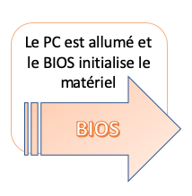
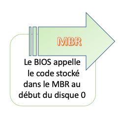
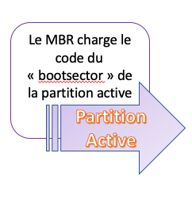
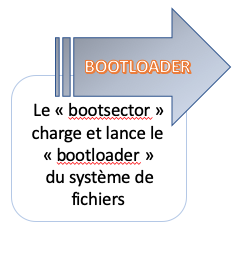
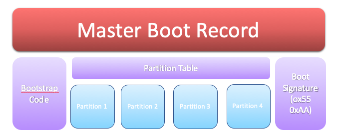
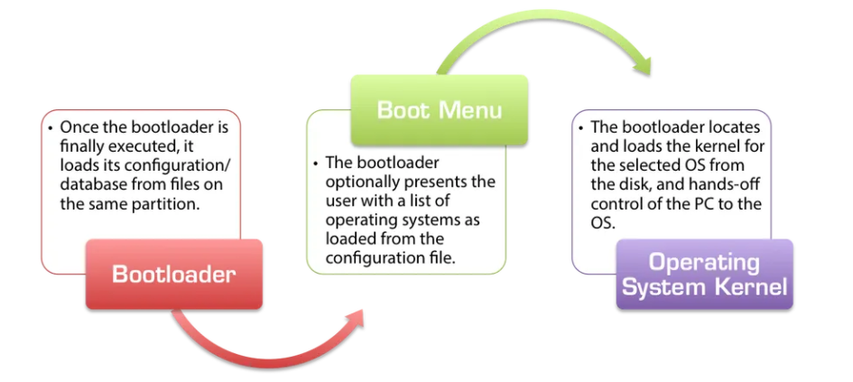
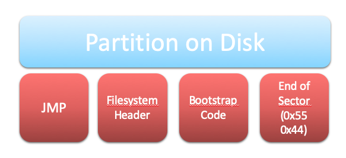
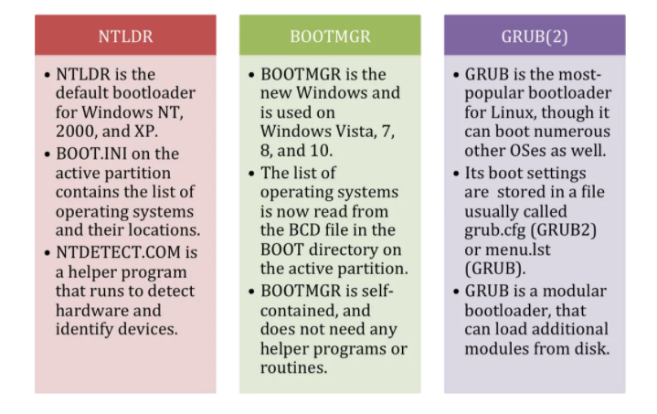
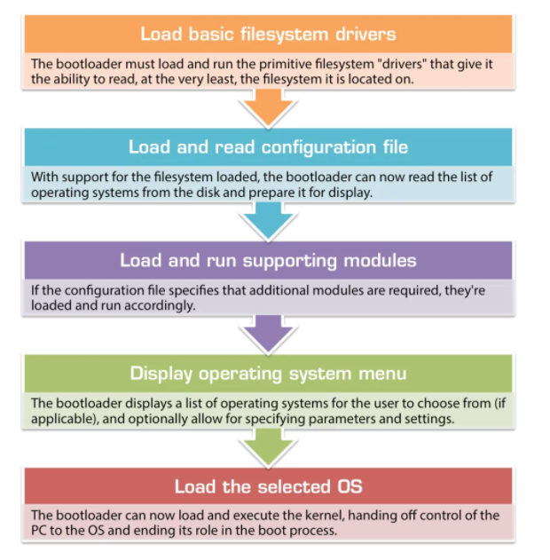

# Metal

:m: MBR 

| | | | |
|----|---|---|---|
| </img> | </img> | </img> | </img> |

</img>

</img>

</img>

</img>

:m: Boot Process

</img>

Le bon vieux metal qui nous détourne de la virtualisation.

:m: Bare Metal(https://github.com/CollegeBoreal/Tutoriels/tree/master/P.Plateformes/0.Metal)

# Références

[MBR Boot Process](https://neosmart.net/wiki/mbr-boot-process)

https://www.techradar.com/web-hosting/best-bare-metal-hosting
