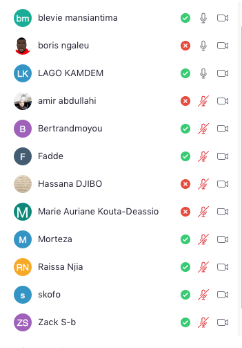

# Virtualization

:one: S'enregistrer sur une plateforme infonuagique

- [ ] [AWS](https://github.com/CollegeBoreal/Tutoriels/tree/master/E.Education/N.Nuages/1.AWS)

- [ ] [Azure](https://github.com/CollegeBoreal/Tutoriels/tree/master/E.Education/N.Nuages/3.Azure)

:two: Installer [Docker-Machine](https://github.com/CollegeBoreal/Tutoriels/tree/master/2.Virtualisation/2.VM/1.Docker)

:three: Créer sa machine virtuelle

- [ ] [AWS](https://github.com/CollegeBoreal/Tutoriels/tree/master/2.Virtualisation/4.Cloud/2.Public/1.AWS/deployment)

## :bookmark: Avez-vous une carte de crédit?

