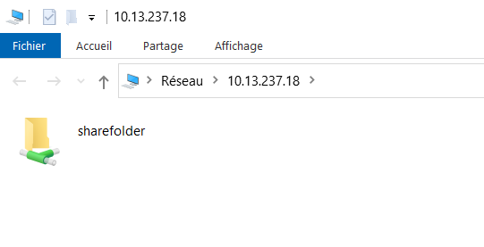
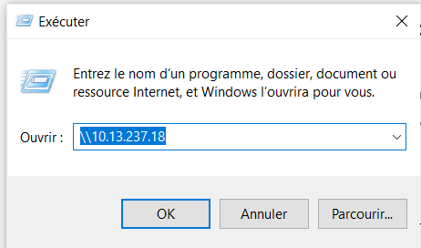
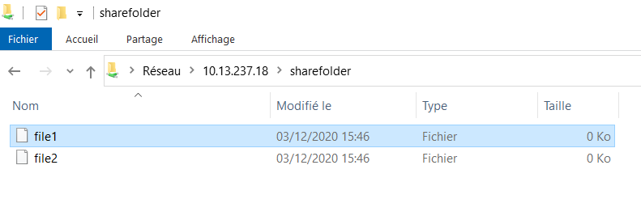

# SAMBA 

## Definition:

Samba est un logiciel qui facilite l'interopérabilité entre systèmes hétérogènes Windows-Unix. Il offre la possibilité aux ordinateurs d'un réseau d'accéder aux imprimantes et aux fichiers des ordinateurs sous Unix et permettent aux serveurs Unix de se substituer à des serveurs Windows10.

## Installation de samba avec la commande

```
luxury@Luxuryking:~$ sudo apt update
luxury@Luxuryking:~$ sudo apt-get install samba
```

### Verification de l'installation avec la commande

```
luxury@Luxuryking:~$ whereis samba
samba: /usr/sbin/samba /usr/lib/x86_64-linux-gnu/samba /etc/samba /usr/share/samba /usr/share/man/man8/samba.8.gz /usr/share/man/man7/samba.7.gz
```

Samba est installe 

### Creation d'un repertoire de partarge avec la commande

```
luxury@Luxuryking:~$ mkdir /home/luxury/sharefolder/
```
### Faire une sauvegarde du fichier de configuration avec la commande

```
luxury@Luxuryking:~$ sudo cp /etc/samba/smb.conf /etc/smb.conf.org
luxury@Luxuryking:~$ sudo nano /etc/samba/smb.conf
```
Ajouter les lignes suivsntes:
  [sharefolder]
          comment = samba on ubuntu
          path = /home/luxury/sharefolder
          browseable = yes
          readonly = no
          
          Enregistre le fichier
          

### Enregistre le fichier et redemarrer Samba avec la commande

```
luxury@Luxuryking:~$ sudo service smbd restart
```
### Configurer le password pour le compte d'utilisateur avec la commande

```
luxury@Luxuryking:~$ sudo smbpasswd -a luxury
```
### Mettre a jour les regles du pare-feu pour autoriser Samba avec la commande

```
luxury@Luxuryking:~$ sudo ufw allow samba
```
# L'installation est terminee et verifier l'addresse de la machine avec la commande

```
root@Luxuryking:~# ip add
```








