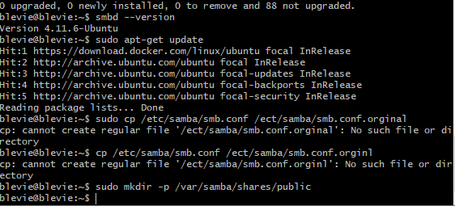
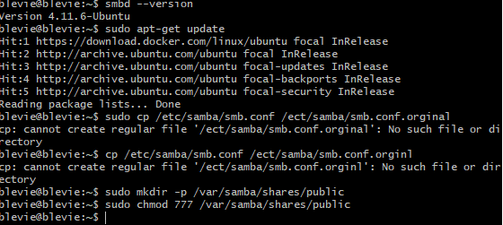

# SAMBA: Sharing files with windows users using samba  :lion:


## 1.	Definition: 

Samba est un logiciel d’interopérabilité qui implémente le protocole propriétaire SMB/CIFS de Microsoft Windows dans les ordinateurs 


## 2. Notre but:


## 3.Créez un compte utilisatateur samba sur le serveur linux


   
   
## 1ère Étape: Installez le serveur samba avec la commande following


```
$ sudo apt -get update
$ sudo apt-get install samba -y
```
   
   
## 2 éme Étape : une fois l'installation terminée, vous pouvez vérifier la version de samba avec la commande followng
       
         
      *  smbd --version
 
      * (administrateuu@ubuntu:$ smbd --version
      *  version 4.11.6-ubuntu
      * administrateur@ubuntu2004: $
 
## Étape 3: Ensuite, nous devons d'abord configurer samba pour activer le partage sur le réseau, créer une sauvegarde du fichier de configuration d'origine
 
    
   
      * (administrateur@ubuntu2004:~$ sudo cp /etc/samba/smb.conf /etc/samba/smb.conf.orignl
      * (administrateur@ubuntu2004:~$ ls /etc/samba/
      * gdbcommands smb.conf.orignl tls
      * administrateur@ubuntu2004:~$
 


## Étape 4: ouvrir smb remplace son contenu par le suivant

```
[global]  
workgroup = workgroup
server string = samba server
netbios name =ubuntu
security =user  
map to guest =bad user  
dns proxy =no
(publique)
  
path= /var/samba/shares/public
browsable=yes
writable=yes
guest ok =yes
read only =no
create mask=644
```

## 5ème étapes: Ensuite, nous devons créer un répertoire partagé


 sudo mkdir -p /var/samba/shares/public  
 (administrateur@ubuntu2004:-$ sudo mkdir -p /var/samba/shares/public  
 adminitrateur@ubuntu2004:-$  

 
 
 
 
## 6éme étapes: modifier les autorisations du répertoire pour le rendre accessible en écriture





```
$ sudo chmod 777 /var/samba/shares/public  
$ sudo chmod 777 /var/samba/shares/public  
$ ls /var/samba/shares/public/ -la  
```
       
       
## 7éme étapes: 

redémarrez le service samba pour que les modifications prennent effet

```
$ sudo service smbd restart
```
  
  
  
  
  (administrateur@ubuntu2004:-$ sudo service smbd restart
  (administrateur @ ubuntu2004: - $ 
  
 
## 8éme étapes : maintenant vous pouvez accéder à ce partage samba sur le client Windows / MacOS
  
             se connecter au serveur 
             
             smb://10.13.237.66
            
             Entre votre nom et mots de passe dans le serveur 10.13.237.66


 
