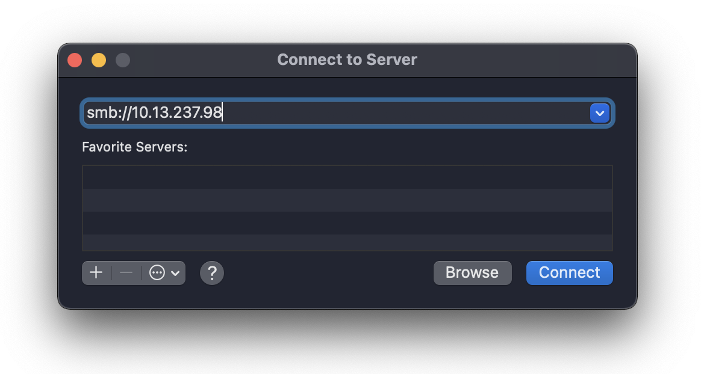
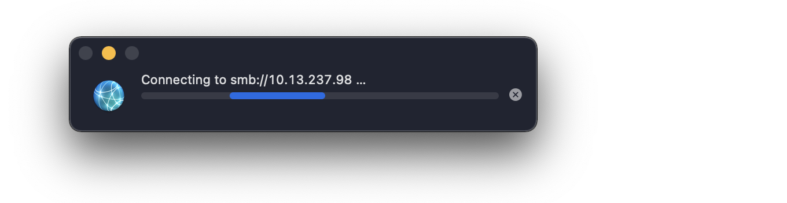
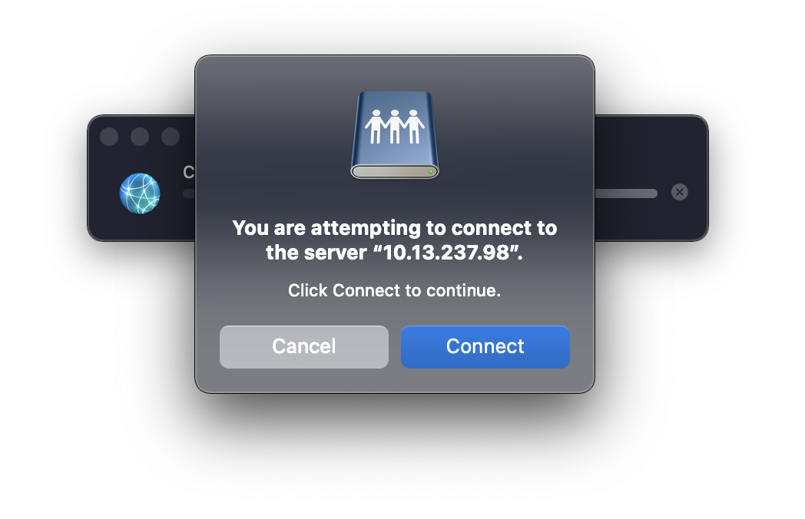
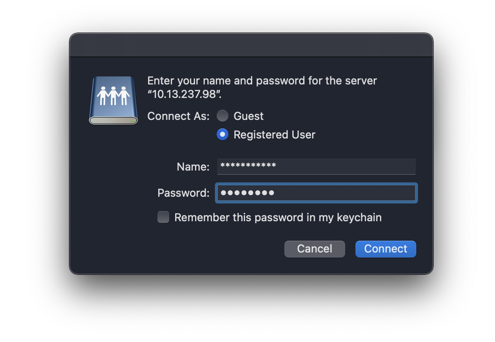
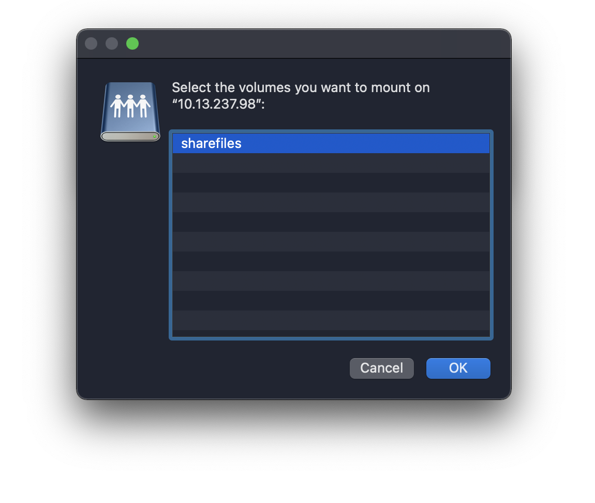
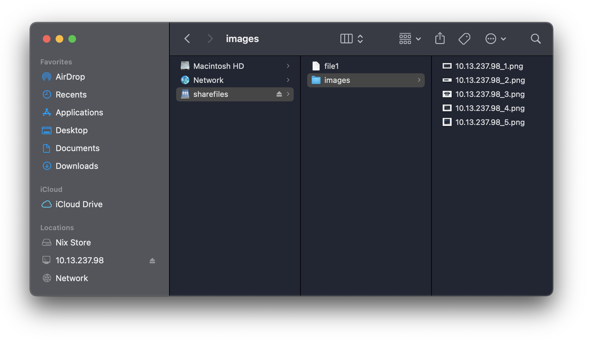

# Samba - 10.13.237.98

### :zero: Entrer les informations de connexion

### :one: Tentative de connexion

### :two: Confirme la tentative de connexion

### :three: Demande d'utilisateur

### :four: Trouve un disque à partager

### :five: Connexion établie - Fichiers copiers sur le disque partagé

