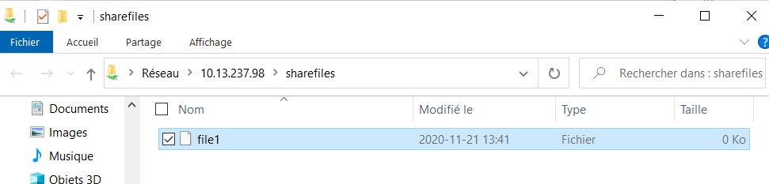

# Mon projet:
## SAMBA 

### 📍Definition:
Samba est un logiciel qui facilite l'interopérabilité entre systèmes hétérogènes Windows-Unix. Il offre la possibilité aux ordinateurs d'un réseau d'accéder aux imprimantes et aux fichiers des ordinateurs sous Unix9 et permettent aux serveurs Unix de se substituer à des serveurs Windows10.

### 📍Installation dans une machine Ubuntu

#### Exécuter la mise à jour
```
fadde@fadde:~$ sudo apt update
```

#### Exécuter l'installation de samba
```
fadde@fadde:~$ sudo apt-get install samba
```

Verifier l'installation
```
fadde@fadde:~$ whereis samba
samba: /usr/sbin/samba /usr/lib/x86_64-linux-gnu/samba /etc/samba /usr/share/samba /usr/share/man/man7/samba.7.gz /usr/share/man/man8/samba.8.gz

```

Se connecter en `Root`
```
fadde@fadde:~$ sudo -i
```

Creer un fichier 

```
# mkdir -p /samba/sharefiles
# touch /samba/sharehome/file1
# chmod 777 /samba/sharefiles

```

#### Configuration
Pour cela, nous devrons ajouter les lignes suivantes dans le fichier de configuration de Samba.

```
nano /etc/samba/smb.conf
```
```
[sharefiles]
  comment = Samba on Ubuntu
  path = /samba/sharefiles
  read only = no
  browsable = yes
  
```
#### Création d'un compte utilisateur Samba:
Pour créer un compte utilisateur pour Samba: 
```
root@fadde:~# adduser abdel
Adding user `abdel' ...
Adding new group `abdel' (1001) ...
Adding new user `abdel' (1001) with group `abdel' ...
Creating home directory `/home/abdel' ...
Copying files from `/etc/skel' ...
New password: abdel
Retype new password: abdel
passwd: password updated successfully
Changing the user information for abdel
Enter the new value, or press ENTER for the default
        Full Name []:
        Room Number []:
        Work Phone []:
        Home Phone []:
        Other []:
Is the information correct? [Y/n] y
```
```
root@fadde:~# smbpasswd -a abdel
New SMB password: abdel
Retype new SMB password: abdel
```
Pour tester la configuration :
```
root@fadde:~# testparm
Load smb config files from /etc/samba/smb.conf
Loaded services file OK.
Server role: ROLE_STANDALONE

Press enter to see a dump of your service definitions

# Global parameters
[global]
        log file = /var/log/samba/log.%m
        logging = file
        map to guest = Bad User
        max log size = 1000
        obey pam restrictions = Yes
        pam password change = Yes
        panic action = /usr/share/samba/panic-action %d
        passwd chat = *Enter\snew\s*\spassword:* %n\n *Retype\snew\s*\spassword:* %n\n *password\supdated\ssuccessfully* .
        passwd program = /usr/bin/passwd %u
        server role = standalone server
        server string = %h server (Samba, Ubuntu)
        unix password sync = Yes
        usershare allow guests = Yes
        idmap config * : backend = tdb


[printers]
        browseable = No
        comment = All Printers
        create mask = 0700
        path = /var/spool/samba
        printable = Yes


[print$]
        comment = Printer Drivers
        path = /var/lib/samba/printers


[sharefiles]
        comment = Samba on Ubuntu
        path = /samba/sharefiles
        read only = No
```
Pour se connecter à l'utilisateur creer: 

```
root@fadde:~# su abdel
abdel@fadde:/root$
```
Pour connecter le partage Samba via la ligne de commande Linux, nous aurons besoin de l'outil `smbclient`. 
Pour installer smbclient, on exécute la commande suivante en tant que sudo :
```
fadde@fadde:~$ sudo apt-get install smbclient
[sudo] password for fadde:

```

```
fadde@fadde:~$ sudo smbclient //localhost/sharefiles -U abdel
Enter WORKGROUP\abdel's password:
Try "help" to get a list of possible commands.
smb: \>
```

On Windows:
```
Start button -> Run
Type: \\10.13.237.98\sharefiles
```

