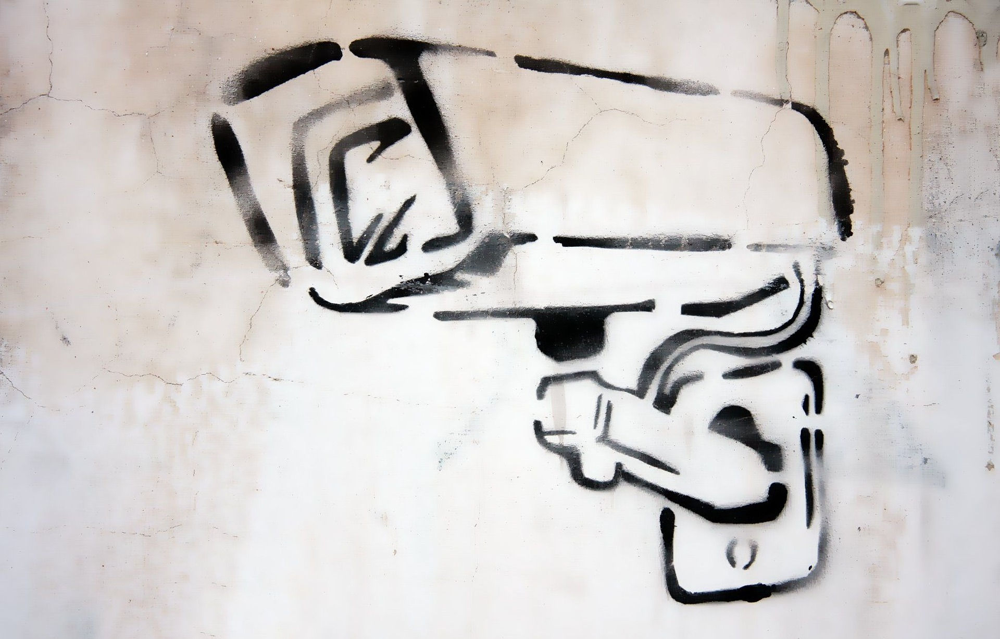

#  |     |PROJET RASPBERRY PI - SYSTEME DE SÉCURITÉ VIDEO EN STREAMING LIVE 📹👮|       | 

## Table des matiéres:
1. Le matériel nécessaire
2. Mettre en marche la fonction caméra sur RaspberryPi
3. Trouver l'adresse IP
4. Télécharger Thonny Python IDE sur Linux
5. Crééer le code Python sur Thonny: les étapes
6. Ouvrir un browser avec l'adresse IP et le port
7. Le rendu de la caméra Live streaming

## Rassembler le matériel Raspberry Pi + CamPi + câbles

## Mettre en marche la caméra sur RaspberryPi(enable camera)

## Trouver l'adresse IP de mon RaspberyPi

## Télécharger Thonny IDE sur Linux

## Créer le code Python sur Thonny IDE

