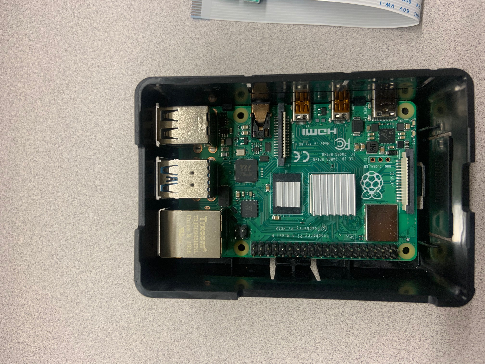

# INSTALLER UNE CAMERA DE SURVEILLANCE AVEC MOTION SUR RASPBERRY PI 4 :camera:

C’est un projet de Christoph BUENGER. L’objectif de ce projet est la réalisation d’une caméra de vidéosurveillance à l'aide d'un Raspberry Pi (Picam) et le flux vidéo est diffusé sur un PC ou sur un smartphone.
Le prix doit rester raisonnable d’où l’utilisation d'un Pi.
 

## :pushpin: SOMMAIRE

I/Matériel et Prerequis nécessaire

II/Installer MOTION 

III/Monter et activer la camera sur le pi 

V/Accéder au flux vidéo 

VII/ 

## Materiel et prerequis

Au prealale, vous devrez vous equipez des elements suivants:

:heavy_check_mark: Un Raspberry Pi 4 sous Raspbian(systeme d'exploitation le plus avance pour le Raspbery Pi  mais vous pouvez utiliser le systeme d'exploitation de votre choix )

:heavy_check_mark:Un module de Caméra Raspberry Pi

:heavy_check_mark:Un adaptateur HDMI

:heavy_check_mark:Un cable d'alimentation pour votre pi

:heavy_check_mark:Une carte SD

:heavy_check_mark: Un clavier et un moniteur

|RASPBERRY | CAMERA | Cable d'alimentation, HDMI converter, Souris, Clavier
|----------|--------|------------------------------------------------------
||          |   

## INSTALLER MOTION

Un très bon logiciel de détection de mouvement et/ou de surveillance avec de nombreuses options de configuration est motion. Il est open-source et gratuit ce qui rajoute encore à ses qualités.

   ### Tout d'abord, effectuer les mises a jour

       $sudo apt update

       $sudo apt full-upgrade

Pour l’installer il faut utiliser la ligne de commande (en se connectant au Raspberry Pi en tant qu’utilisateur “pi“):

       $sudo apt-get install motion

Un certain nombre de paquets vont être installés pendant la phase d’installation. Répondez simplement “y” pour autoriser l’installation.
 
   

Modifiez également le démon de motion pour que motion fonctionne en permanence :

        $sudo nano /etc/default/motion
        
  
  

Modifiez cette ligne comme suit :

        *start_motion_daemon=yes

**Les principaux changements sont les suivants** :

S’assurer que motion est toujours en cours d’exécution en tant que démon en arrière-plan :

        daemon on

Le fichier journal va être enregistré dans le répertoire /tmp sinon l’utilisateur autostart ne pourra pas accéder au répertoire /home/pi :

        logfile /tmp/motion.log

Pour avoir une vidéosurveillance de bonne qualité la définition est fixée à 1280 x 720 pixels :

         width 1280
         height 720
         

La vidéosurveillance peut se contenter de 2 images par seconde. Le flux vidéo continu est inutile :

        framerate 2
        

Nous ne voulons pas de films sans fin. Au lieu de cela, nous voulons avoir au plus des séquences vidéo de 10 minutes maximum. Cette option de configuration qui s’appelait max_movie_time a été renommée  max_mpeg_time dans motion. Si vous utilisez la version motion-mmal, cela fonctionne. Si vous obtenez une erreur Unknown config option  “max_mpeg_time” modifiez l’option en max_movie_time ou assurez-vous d’utiliser vraiment la version motion-mmal comme indiqué ci-dessus.

        max_mpeg_time 600
        

Certains lecteurs multimédia comme VLC sont incapables de lire les films enregistrés. En utilisant le codec msmpeg4 les films sont lus par tous les lecteurs.

       ffmpeg_video_codec msmpeg4
       

Pour pouvoir lire le flux vidéo en direct de n’importe où il faut l’autoriser. Sinon, seul localhost (le Raspberry Pi lui-même) serait autorisé à accéder à la diffusion en direct :

        stream_localhost off
        

Si vous voulez protéger le flux vidéo le flux avec un login et un mot de passe, ajoutez l’option suivante :

        stream_auth_method 2
        stream_authentication LOGIN:MOT_DE_PASSE

Après avoir réalisé vos modifications de paramètres dans motion.conf, redémarrez le Raspberry Pi pour qu’ils soient pris en compte :

         sudo reboot

Après le redémarrage, la LED rouge de la caméra devrait être allumée, indiquant que motion utilise la caméra pour détecter tout mouvement.

**MONTER ET ACTIVER LA CAMERA SUR LE PI**

Sur le Pi , vous verrez "camera" ecrit devant un port, c'est la que vous mettrez votre caméra

      
 
 
 **Maintenant on va enable notre camera**

 A l'aide de la commande suivante 
 
    sudo raspi-config

Interfacing options>Pi Camera> Enable , utiliser Tabulation pour defiler dans les menus.

    
  
  
 
 
 
 Apres avoir intaller vootre camera , verifier si elle fonctionne en utilisant la commande suivante:
(Vous pouvez mettre ce que vous voulez à la place de test)

        $raspistill -v -o test.jpg
        
 Normalement le pop-up suivant devrait s'ouvrir 
 
 
 
Sinon entrez la commande suivante pour verifier que le Pi detecte et supporte bien la camera:

       $vcgencmd get camera

Si l'un des résultats affiche 0 veuillez vérifier si vous avez bien connecter/brancher votre caméra sinon prenez en une autre.

        
        
## Accéder au flux vidéo

**Trouver l'adresse IP**

Afin d'acceder au flux video il vous faut vore addresse ip. Tapez la commande suivante dans votre terminal

      $ip address
      
  
 
 
 Notre adresse IP est **172.20.10.6**
 
 
Maintenant, vous pouvez accéder à la diffusion en direct de la caméra depuis n’importe quel navigateur via l’url **http://adresse_IP_du_raspberry:8080** . 

(image)

Où 8080 est le port qui est configuré dans le fichier motion.conf. Vous pouvez faire votre propre réglage pour le port en modifiant le paramètre “stream_port” dans motion.conf.

:warning: Votre Pi et l'appareil sur lequel vous acceder à l'enregistrement video doivent etre dans le meme reseau pour fonctionner. Sinon pour avoir acces a votre flux video n'importe ou, utilisez un VPN.

## CONFIGURATION SSH

:loudspeaker: :heavy_exclamation_mark: :loudspeaker: :heavy_exclamation_mark:
Soyez sûr que les permissions sur les fichiers sont correctes : lorsque vous installez motion via ssh en étant connecté en tant qu’utilisateur “pi”, vous devez vous assurer de donner à l’utilisateur «motion» les autorisations pour exécuter motion comme service après le redémarrage :

      sudo chmod 664 /etc/motion.conf

      sudo chmod 755 /usr/bin/motion

      sudo touch /tmp/motion.log

      sudo chmod 775 /tmp/motion.log

