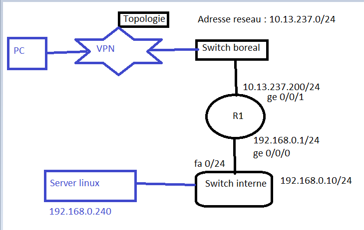

## Reseau local  d'entreprise Amir Abdullahi 



:bookmark:  Objctif : du projet est configuration routage inter-vlan 
------------------------------------------------------------------------------
1.Routeur 
---------
Etape 1: configure de base  d'un routeur cisco 
------------------------------------

```
R1#en
config t
hostname R1
R1(config)line console 0
R1(config)password cisco 
R1(config)login
R1(config)exit
R1(config)line vty 0 4
R1(config-line)password cisco 
R1(config-line)login 
R1(config-line)#exit 
R1(config)#enable secret cisco
R1(config)#do wr
``````
#configuration SSH du routeur 
```
R1(config)#ip domain-name borealc.on.ca 
R1(config)#crypto key generate rsa
R1(config)line vty 0 4
R1(config-line)#transport input ssh
R1(config-line)#transport input ssh
R1(config-line)#login local
R1(config-line)#exit
$ ssh -oKexAlgorithms=+diffie-hellman-group14-sha1  amirali12@10.13.237.200
Password:Terminal@12
```
Etape 2 : configure mode priviligie d'un routeur cisco 
-------------------------------------------------------
``` 
R1(config)#interface Ge 0/0/0
R1(config-if)#ip address 192.168.0.1 255.255.255.0
R1(config-if)#no shutdown
R1(config-if)#exit
R1(config)# interface Ge 0/0/1
R1(config-if)#ip address 10.13.237.200  255.255.255.0
R1(config-if)#exit
R1(config)#do wr
R1(config-if)#exit
R1# ip route 0.0.0.0 0.0.0.0 Ge0/0/1
```

2.Switch 
------------
Etape : configure de base switch 
---------------------------------
 
````
Switch>en
Switch#config t
Switch(config)#hostname S0 
S0(config )#enable secret cisco
S0(config)#line console 0
S0(confi-line)#password cisco
S0(confi-line)#login 
S0(confi-line)#line vty 0 15
S0(confi-line)#password cisco
S0(confi-line)#login
S0(confi-line)#exit
S0(config)#do wr
````
configuration SSH du commutateur (switch )
```
S0(config)#ip domain-name borealc.on.ca 
S0(config)#crypto key generate rsa
S0(config)#line vty 0 4
S0(confi-line)#transport input ssh
S0(confi-line)#transport output ssh
S0(config-line)#login local
S0(config-line)# username amirali11 password Terminal@11

```
  utiliser le meme commande de base les autres swith

Etape : configuration vlan 
--------------------------

#configuration address ip du vlan 1
```
 Switch(config)#int vlan 1
 Switch(config-if)#ip address 192.168.0.10 255.255.255.0
Switch(config-if)# no shutdown 
Switch(config-if)# exit
```
 

Configuration protocole DHCP 
-----------------------------
```
R1#config terminal 
R1#(config)# ip dhcp pool boreal
R1#(dhcp-config)# Network 192.168.0.0 255.255.255.0 
R1#(dhcp-config)# default-router 192.168.0.1 
R1#(dhcp-config)# domain-name borealc.on.ca 
R1#(dhcp-config)#exit

```
:address ip sever linux 192.168.0.240:

#:o: Referrence https://www.astarox.com/blog/configuration-ssh-cisco-b12.html


GRACIAS 

"MERCI BORIS ET MORTI ainsi les camarades de classe ":avocado:
---------------------------------------------------------------


