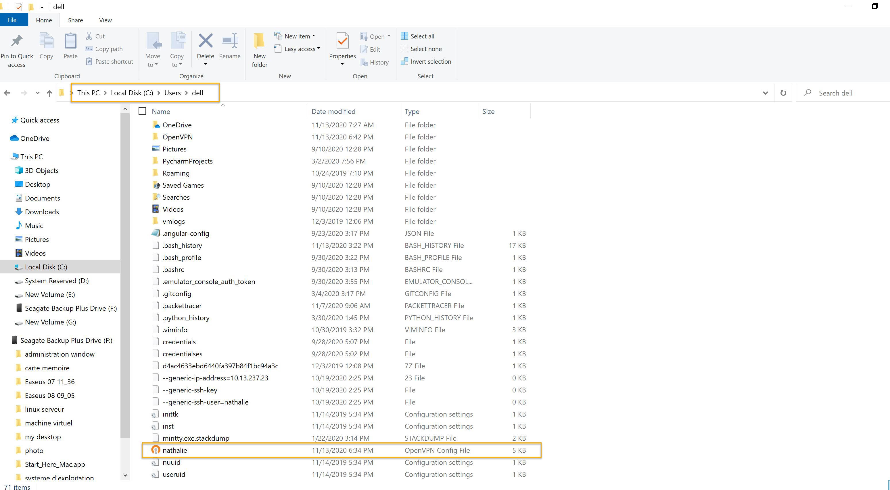
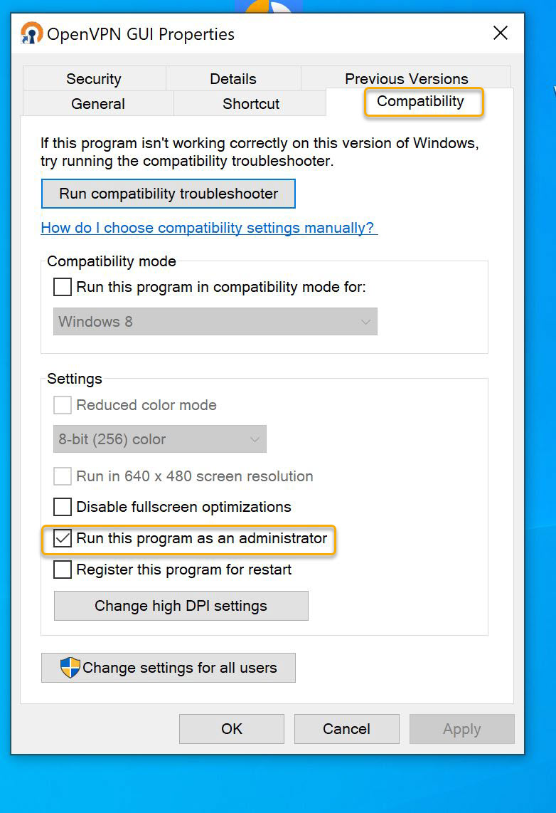
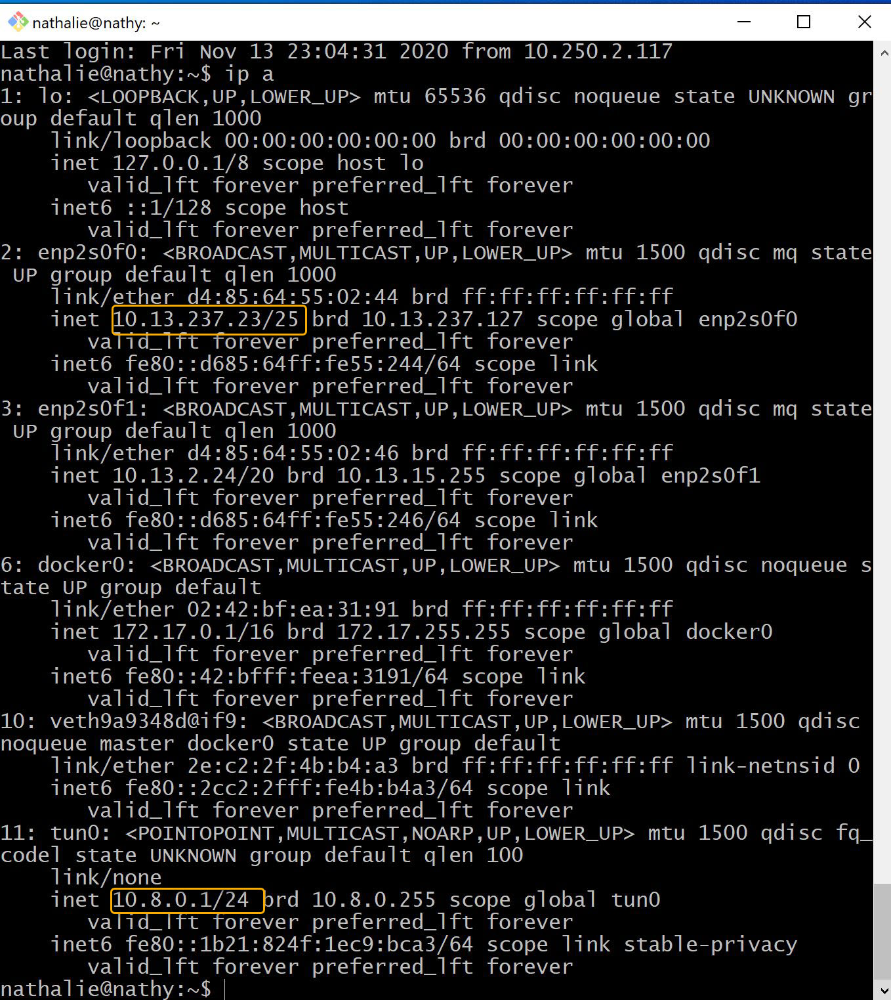

# :sparkles: NETWORK CONNECTION VPN SUR UBUNTU 20.04 LTS :sparkles:
:heavy_check_mark: Notre travail consiste a créer un OPEN VPN sur notre serveur Debian prolian.

 
:heavy_check_mark: Nous allons créer un tunnel pour pouvoir nous connecter à distance sur notre serveur du collège Boréal. Ce tunnel est en fait une application VPN Open source qui va nous permettre d’atteindre notre réseau privé. Nous vous parlerons des étapes à suivre pour réaliser un OPENVPN sur notre serveur.

 
## Step 1 : Mise a jour du system
:heavy_check_mark: Si votre système n’est pas jours, vous devez le mettre à jour avec la commande suivante:
```
$ sudo apt update
```
```
$ sudo apt list –upgradable
```

## Step 2 : trouver et noter votre adresse IP
:heavy_check_mark: Utiliser la commande suivante:
```
$ ip a

$ ip a show eth0
``` 

## Step 3 : Telecharger et exercuter openvpn-install.sh
:heavy_check_mark: Pour notre cas nous allons utiliser le wget command pour le télécharger:
```
$ wget https://git.io/vpn -0 openvpn-ubuntu-install.sh
```


:heavy_check_mark: Après avoir téléchargé le script, nous devons le rendre exécutable avec la commande suivante:
```
$ chmod -v +x openvpn-ubuntu-install.sh
```


 
:heavy_check_mark: Une fois que nous avons demandé la permission a notre serveur pour exécuter le script on peut ouvrir notre script avec l’éditeur nano/vim.
```
$ nano openvpn-ubuntu-install.sh
```


 
:heavy_check_mark: Nous pouvons maintenant exécuter notre script avec la commande suivante:
```
$ sudo ./openvpn-ubuntu-install.sh
```


 
:heavy_check_mark: Avant l’installation de l’openvpn vous devez répondre a une série de questions a savoir:

:bulb: Si vous avez plusieurs adresses IP vous devez choisir l’adresse IP que vous voulez utiliser en mettant le numéro correspondant

:bulb: On remarque ici que le système nous a donné notre adresse IP publique qu’il a convertir grâce à notre adresse IP privée. Notre adresse IP publique ici est 205.211.23.237.

:bulb: Choisir le procole que votre OpenVPN doit utiliser. Dans notre cas nous avons choisir le protocole UDP qui est d’ailleurs recommande par le système

:bulb: Note openVNP va utiliser le port 1194,

:bulb: Nous avons choisir un DNS par défaut qui est 1.1.1.1,

:bulb: Enfin nous pouvons entre le nom de notre client. On peut ajouter autant de clients qu’on veut en faisant la même commande.

:heavy_check_mark: On peut arrêter, démarrer, redémarrer et voir le statut de notre OpenVPN avec la commande: sudo systemctl stop, start, restart et statut openvpn-server@server.service.

:heavy_check_mark: Pour notre cas nous allons juste voir le statut de notre OpenVPN:
```
$ sudo systemctl status openvpn-server@serve.service
```


:heavy_check_mark: Quand nous faisons de nouveau la commande IP a on peut remarquer que notre OpenVPN a été bien créer. Nous remarquons donc tunnel point to point avec l’adresse IP qu’il nous a attribuée 
```
10.8.0.1/24
```


## Step 4: Connection a notre OpenVPN serveur a partir de notre ordinateur portable qui est considerer comme client:
```
$ ssh nathalie@10.13.237.23 “sudo -S cat /root/nathalie.ovpn” > nathalie.ovpn
```
:heavy_check_mark: Âpres faire ls pour voir ou est localise votre openvpn dans votre ordinateur


## Step 5: installation OPENVPN dans notre ordinateur portable
:heavy_check_mark: Utiliser power shell pour installer openvpn dans votre ordinateur avec la commande suivante:
```
Ps> Choco install openvpn
```


 
:bulb: Trouvez l’emplacement du fichier installer dans votre ordinateur. Ouvrir le fichier changer l’adresse IP publique par votre adresse IP privée.
    

:bulb: Fais fichier enregistrer sous pour changer l’emplacement et le mette dans 
```
program files, openvpn, config
```


:bulb: Faire un clic droit sur l’icône OpenVPN GUI et allez a:
```
propriété, comptabilité et cocher run this as an administrator.
```


 
:bulb: Une fois cela fais vous pouvez ouvrit OpenVPN dans votre ordinateur en doublecliquant sur l’icone qui est sur votre desktop ou en ouvrant le fichier a partir de la barre de tache dans le menu demarrer. 
 


:bulb: Une fois connecte a notre VPN nous pouvons vérifier notre connexion avec le CMD Prompt. En faisant la commande IP config. Alors vous voyons apparaitre l’adresse IP de notre application OpenVPN qui est 10.8.0.2/24 et on remarque également en faisant la commande tracert 10.8.0.1 on vois le nombre de temps effectuer pour arriver a notre serveur. 
Aussi en faisant la commande IP a dans notre server on vois clairement nos deux adresses c’est-à-dire l’adresse IP de notre serveur et l’adresse IP openvpn.
  
  
## :sparkles: References :sparkles: :

:heavy_check_mark:(https://www.tecmint.com/install-openvpn-in-ubuntu/ )

:heavy_check_mark:(https://www.cyberciti.biz/faq/ubuntu-20-04-lts-set-up-openvpn-server-in-5-minutes/)


