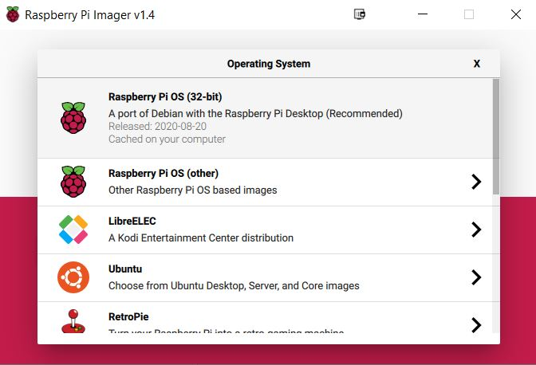

#  :pushpin: Video Streaming

---
# Introduction et matériel utilisé
* **Raspberry Pi** [->](https://www.amazon.fr/gp/product/B00Q8MM4PI/ref=as_li_tl?ie=UTF8&camp=1642&creative=6746&creativeASIN=B00Q8MM4PI&linkCode=as2&tag=magdiblog-21&linkId=ILNQLTZCCS5EITBS)

* **Module Camera** [->](https://www.amazon.fr/gp/product/B00E1GGE40/ref=as_li_tl?ie=UTF8&camp=1642&creative=6746&creativeASIN=B00E1GGE40&linkCode=as2&tag=magdiblog-21&linkId=5AG5Y5WRP3IRFDAU)

* **Carte micro-SD Sandisk 8Go**

 
---
```{r setup, include=FALSE}
ALL STEPS:
```
DESCRIPTION
--------------------------------------------------
### :a: :star: First Step :star:
:one: On installe **Raspbian**, tout ce qu’il y a de plus standard, on se connecte à son réseau WiFi et on active le module caméra grâce à l’outil **raspi-config**.


 ## **INSTALLER Raspbian SUR SON RASPERRY PI**
 1. Installer raspberry imager[->](https://www.raspberrypi.org/software/)
 2. Choisir un system d'exploitation dans mon cas j'ai choissis Raspbian
 ## **NB:choisir raspian est tres conseille pour pouvoir facilement utilise le module camera et autres plugins raspberry pie**
 
 </img>
 
 
 3. Choisr la carte sd dans laquelle vous allez monter l'image
 4. write
 
  </img>
 
  
 ### :b: Second Step 
 :two: configurer et activer notre camera
 
 1. Installer les dernieres mis a jour du noyau
 
```{r}
$ sudo apt update
$ sudo apt full-upgrade
```
2. activez votre camera grace a la commande

```{r}
sudo raspi-config

```
**interface option** puis **camera**
## :exclamation:**NOTE:Installer raspi-config on linux si vous ne l'avez pas par default [==>](https://rootsaid.com/raspi-config-install-setup-in-any-raspberry-pi-linux-os/)**


**NB: EN General le module camera est par default activer** 

3. tester votre camera

```{r}
$ raspistill -v -o test.jpg

```
vas donner un preview et prendre une photos test.jpg

### :cinema: Last Step:Video Streaming avec raspberry pie camera :cinema:
1. voir son addresse ip

```
$ sudo apt-get install net-tools
$ sudo ifconfig | grep -i mask

```
2. ecrivons notre script screaming


 
 
 ## **set Noobs**

Rules
--------------------------------------------------
### CODE
```{r}

```
### SOURCE
```{r}
```


