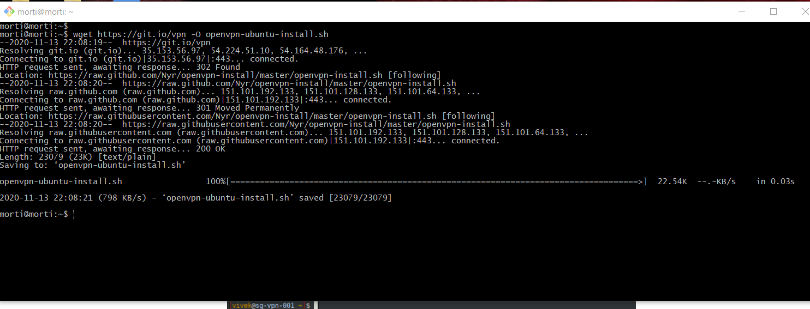
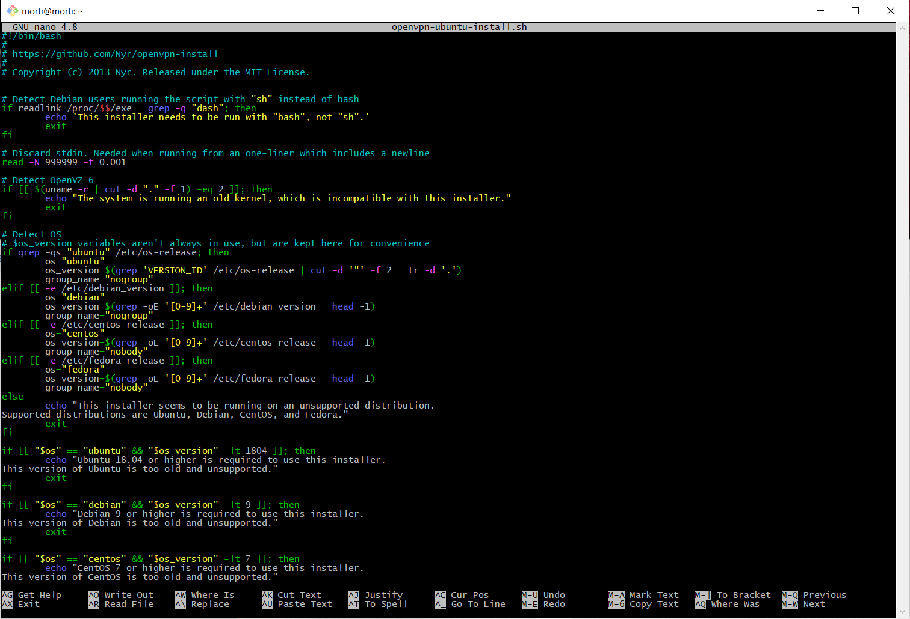
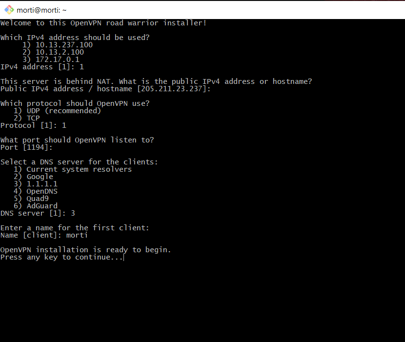
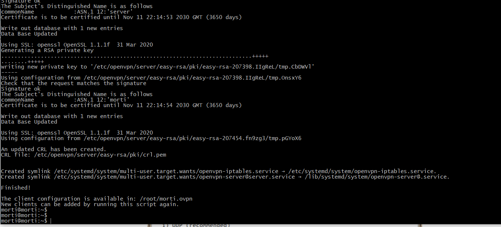
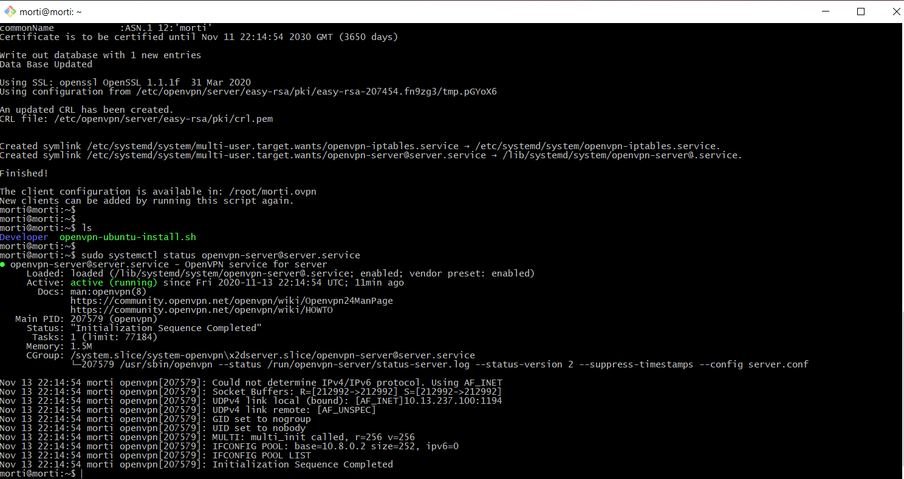
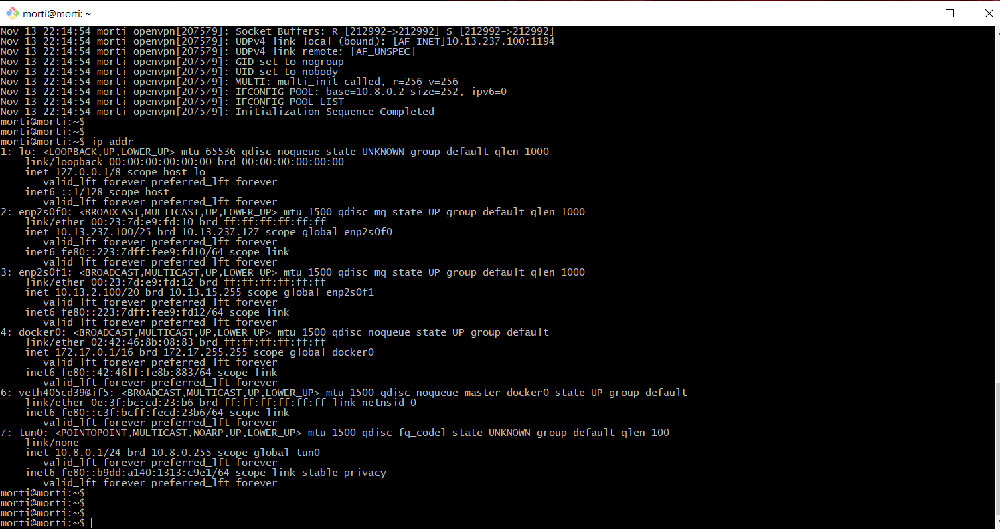
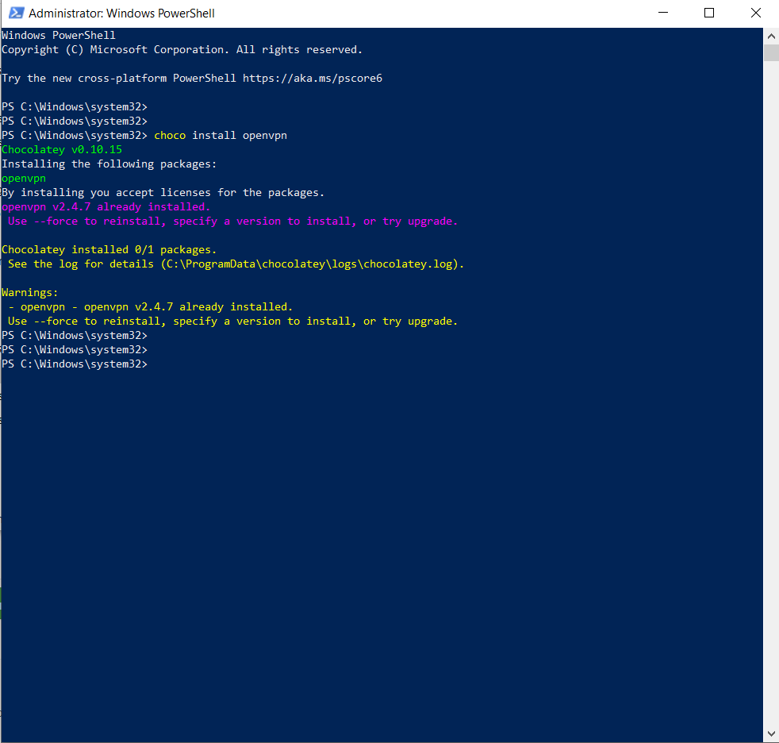
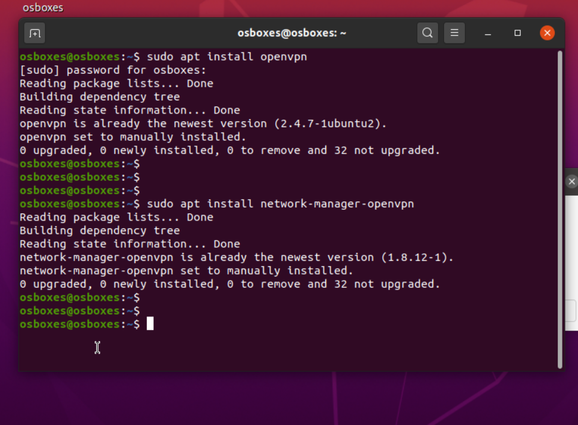
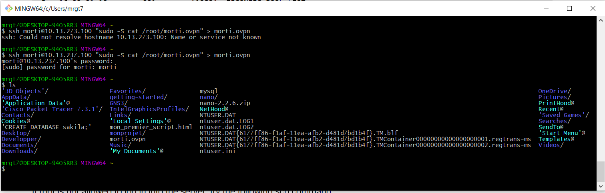
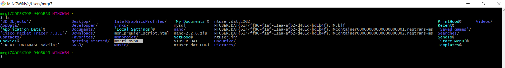

-- En utilisant ce commande on peut télécharger le script d'installation de OpenVPN:

:~$ wget https://git.io/vpn -O openvpn-ubuntu-install.sh

-- Maintenant on va changer le mode scrip pour le rendre executable: 

:~$ chmod -v +x openvpn-ubuntu-install.sh

--on peut vérifier le contenu du fichier en utilisant nano ou vi: 

:~$ nano openvpn-ubuntu-install.sh

-- executer le script pour installer le serveur OpenVPN 

:~$ sudo ./openvpn-ubuntu-install.sh

-- D'abord vous devevez choisir que quelle adresse IP sera utilisée par votre client OpenVPN pour se connecter au serveur.
   Dans ce cas, mon client utilisera 10.13.237.100.
   Après vous pouvez vérifier que votre adresse IP pulic sera utilisé afin que votre serveur soit capable de se connecter à l'internet.
   dans l'étape suivante, vous devez choisir votre DNS server.
   Maintenant, vous devez écrire le nom de votre utilisateur, et ça va devenir le nom de script qui sera créé par votre serveur, avec lequel, votre clien      sera capable de se connecter à ce serveur. Dans ce cas, j'ai écrit (morti).
   

  -- Une fois que la configuration sera terminé, vous pouvez vérifier dans les deux dernières lignes, le chemain pour avoir au script créé par votre serveur      pour votre clien nomé morti.ovpn. oon va l'utiliser pour importer ce script dans notre client-OpenVPN.
  
 
  
-- Maintenant votre Openvpn-serveur ets prêt, et vous pouvez vérifier son statut en utilisant la commande suivante:
  
-- sudo systemctl status openvpn-server@server.service
--le statut du serveur, c'est active(running) 

pour changer le statut de votre serveur, vous pouvez utiliser les commandes suivantes selon vos besoins:

 --:~$ sudo systemctl start openvpn-server@server.service
 --:~$ sudo systemctl restart openvpn-server@server.service
 --:~$ sudo systemctl stop openvpn-server@server.service

--Le moment où, vous configuré votre serveur OpenVPN avec le script openvpn-ubuntu-install.sh, une spécifique interface sera configuré pour votre connexion,
--le status de cette interface sera point-to-point, et utilise l'adresse IP de l'intervalle 10.8.0.0/24.
-- on peut le vérifier avec la commandeci-dessous:

--:~$ ip addr

--- Maintenant, on doit installer OpenVPN sur la machine de notre client:

-- sur Windows, oo peut utiliser:

-- > choco install openvpn 

-- sur Linux, on peut utiliser:

-- sudo apt-get install openvpn

-- sudo apt-get install network-manager-openvpn

-- Maintenant c'est le moment d'arriver à notre serveur et prendre notre script de configuration.
-- Dans notre machine client-serveur, en utilisant cette commande, on arrive à notre serveur en utilisant Gitbash, et on copie ce fichier dans notre machine:

 -- ssh morti@10.13.237.100 "sudo -S cat /root/morti.ovpn" > morti.ovpn
 
 
 
 
 
 
