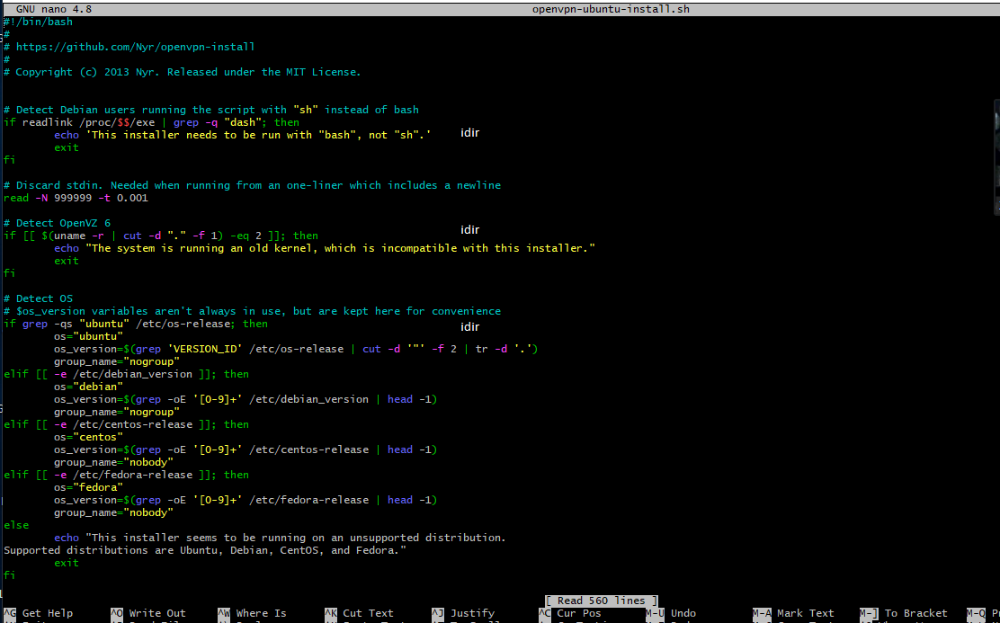
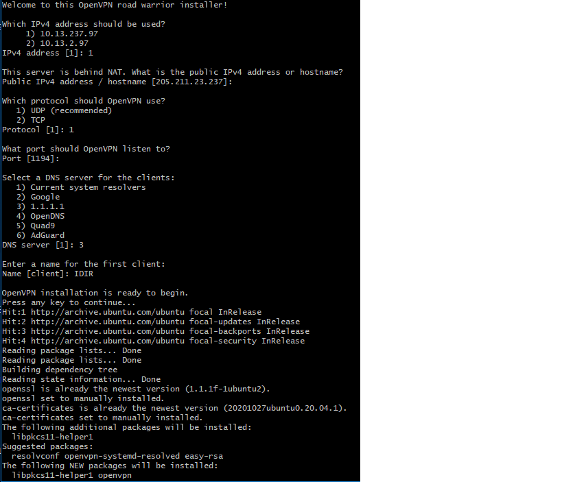

# :star: Projet VPN  : CRÉER UN VPN POUR SÉCURISER LES CONNEXIONS RÉSEAUX  :star:
:rose: Dans ce tutoriel, vous aller apprendre de la maniere la plus simple comment creer un OPEN VPN sur votre votre server Debian . :rose:
OpenVPN est un logiciel libre permettant de créer un réseau privé virtuel VPN   il cree une sorte de tunnel qui va vous permettre de vous connecter a distance a votre server du College boreal :sunglasses:  . 

## Table des matières
  1. Les mises à jour
  2. Connaitre sont adresse IP
  3. Statut de notre openvpn
  4. Installation openvpn
  5. Verification d'installation
  
  
## :rose: 1. Les mises à jour du systeme : :rose:
Tout d'abord vous devez mettre a jour votre systeme grace a la commande suivante :

   $ sudo apt update 

  $ sudo apt list –upgradable

Le systeme se mettra automatiquement a jour  comme dans l'image si dessous :

</img>
</img>

:zap:                   :zap:                 :zap:                     :zap:                     :zap:

## :rose: 2. Trouver votre adresse IP :rose: :

Vous devez entrer la commande suivante :

  $ ip address

 :point_down: :point_down: :point_down: :point_down: :point_down: 
 
</img>

 ## :rose: 3. Statut de votre OpenVPS ::rose: 

Premierement vous devez telecharger le wget,pour cela rien de plus simple :point_right: entrer la commande suivante :

  $ wget https://git.io/vpn -O openvpn-ubuntu-install.sh  

</img>

Une fois le script telecharger,place maintenant place a l'execution de ce dernier :
  $ chmod -v +x openvpn-ubuntu-install.sh

</img>

Il suffit de demander d'abord la permission ; nous pouvons a l'aide de lediteur  nano/vim executer ouvrir le script :

 $ nano openvpn-ubuntu-install.sh

</img>

 ## 4.  :rose: l'installation et l'execution de OpenVPN :rose::rose: :rose:
 
 Nous pouvons maintenant installer notre script avec la commande suivante:

$ sudo ./openvpn-ubuntu-install.sh

 :point_down: :point_down: :point_down: :point_down: :point_down:
 
</img>

</img>

Avant de pouvoir installer OpenVPN,vous devez d'abord repondre a quelque question :
- 1 Vous devez choisir une adresse IP ( choisir 1 pour celle du college Boreal)
- 2 Le systeme nous attribue automatiquement une addresse IP public a partir de notre adresse ip priver (205.211.23.237 dans l'exemple dans l'image)
- 3 Vous aurez le choit de choisir entre deux protocole ,dans notre cas nous choisiront le UDP(recommander) au lieu du TCP
- 4 OpenVPN va directement choisir le port 1194
- 5 Vous devez selectionner un server DNS pour les client,entrez le numero 3 (1.1.1.1)
- 6 Entrer un nom de client .
- 7 Cliquez sur n'importe auelle touche apres le message suivant : "OpenVPN installation is ready to begin.
press any key to continue ..."

l'installation va commencer .

 Vous devriez avoir la meme chose que dans l'image ci dessous 

:point_down: :point_down: :point_down: :point_down: :point_down:

</img>

</img>

 Nous allons maintenant verifier le status de notre OpenVPN avec la commande suivante :

 $ sudo systemctl status openvpn-server@server.service

</img>

  Une fois OpenVPN installer, faite un clique droit sur l'icone de l'application et aller dans proprieter ,aller dans "comptabilite"  et Cocher "Executer ce programme en tant qu'administrateur"

</img>

  Vous verrez ensuite cette fenetre apparaite en bas de votre ecran a droite :

</img>

  Maintenant il est temps de changer l'addresse IP public par votre addresses du college Boreal (il suffit de changer 97 par votre chiffre pour pouvoir se connecter au server du college ) :

</img>

  Vous pouvez maintenant voir tout les details de votre connexion a distance grace a OpenVPN :

</img>

:zap:                   :zap:                 :zap:                     :zap:                     :zap:

## :rose: 5. Verification d'installation :rose:

</img>

</img>

</img>

## :rose: :rose: :rose: :rose: MERCI POUR VOTRE VISITE :rose: :rose: :rose: :rose:

