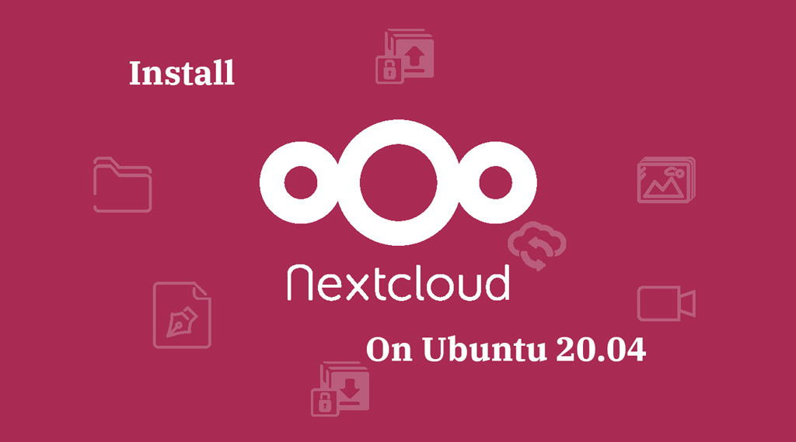
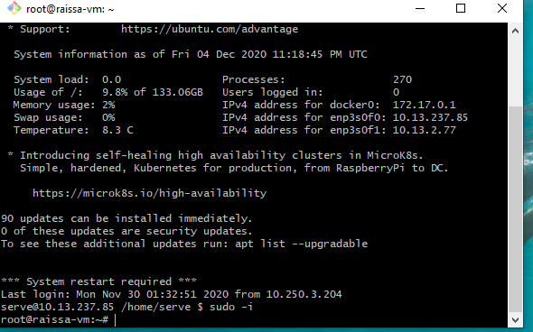
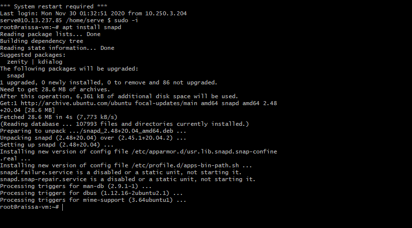
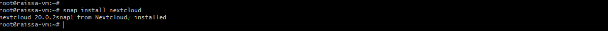

# :sparkles:  INSTALATION DE NEXTCLOUD SUR UBUNTU 20.04 LTS :sparkles: 

---

</img>
 
# :star: DEFINITION :star:

Nextcloud est un logiciel libre, de site d’hébergement de fichiers  et une plateforme de collaboration.

## Comment installer NEXTCLOUD sur ubuntu serveur 20.04 LTS :question: 

## :pushpin: Step 1:Allez en mode administrateur

```
$ sudo -i
```

</img>

 ## :pushpin: Step 2:Instalation de Snap
 
:heavy_check_mark: **Snap** C'est un système de packaging, disponible sur Ubuntu 20.04 par défaut et qui permet aux organisations d'expédier les logiciels, ainsi que toutes les dépendances et la configuration associées, dans une unité autonome avec des mises à jour automatiques.
```
$ apt install snapd
```
</img>

 ## :pushpin: Step 3:Instalation de Nextcloud en utilisant le système de packaging snap

:heavy_check_mark: Le format snap vise à permettre l'installation de nouvelles versions de logiciels dans les systèmes Linux, tout en apportant la facilité de distribution, la fiabilité et la sécurité.

```
$ snap install nextcloud
```

</img>

