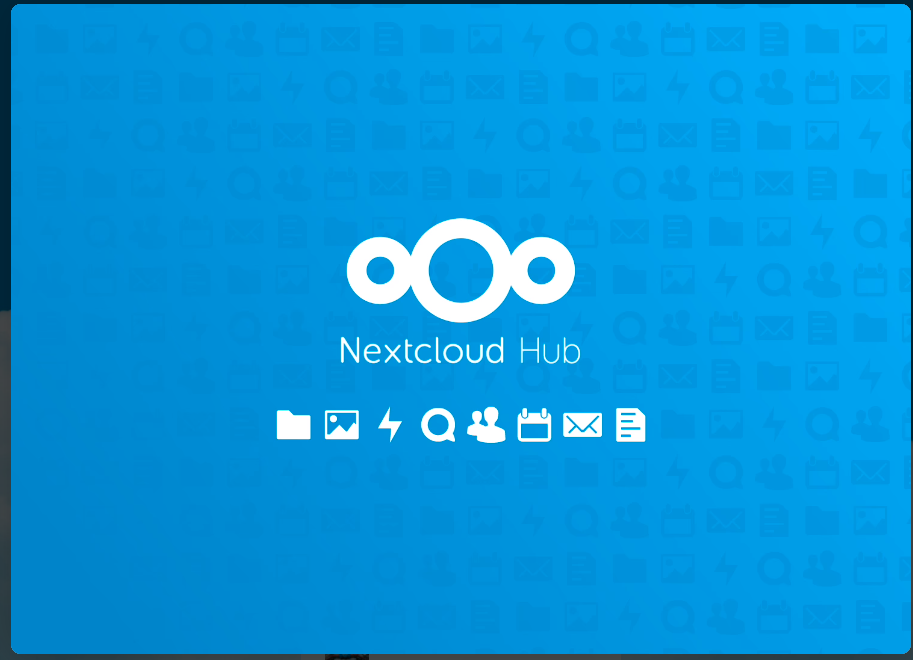
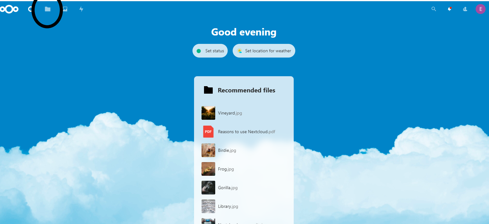
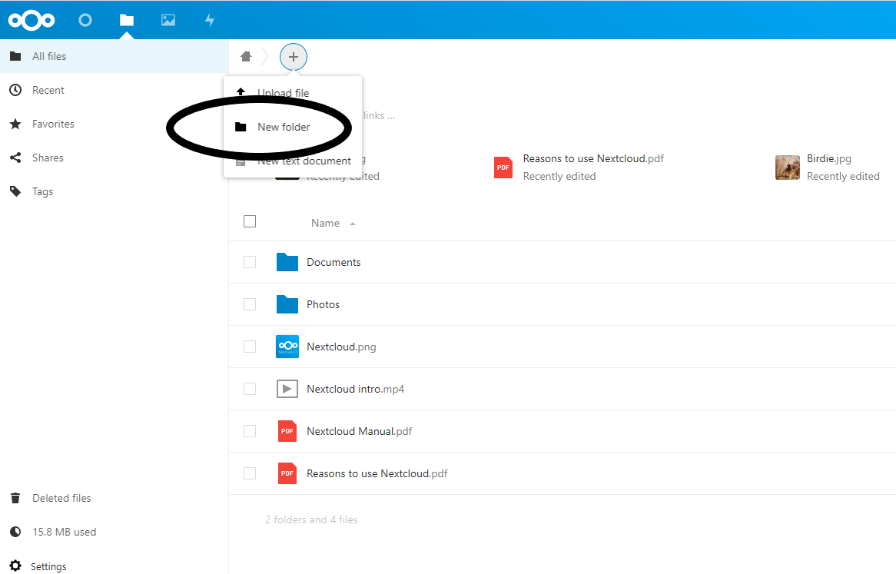
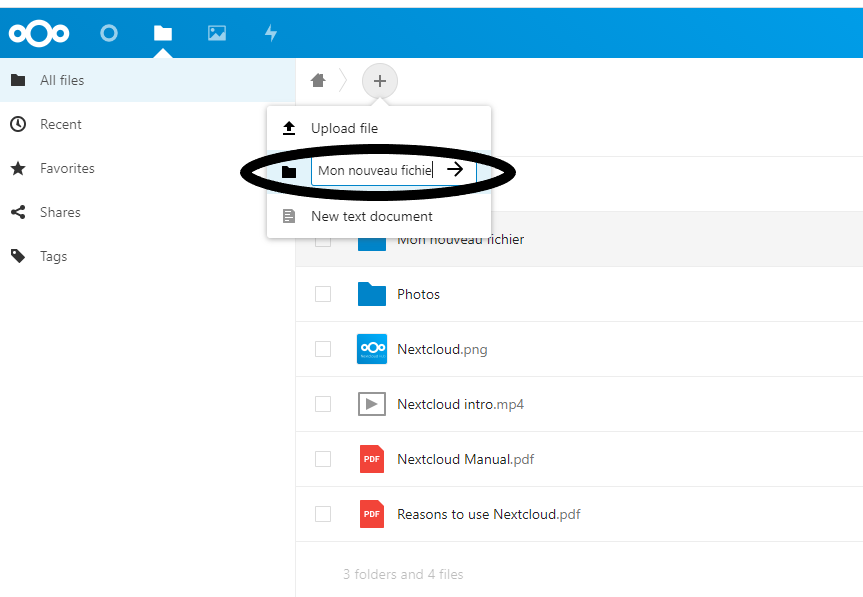
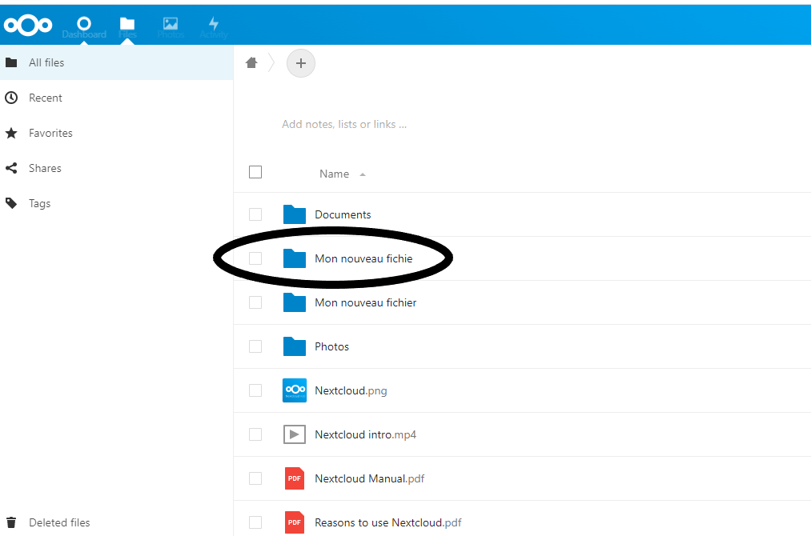
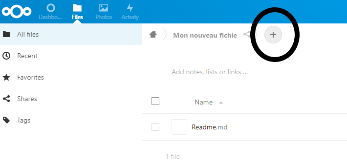
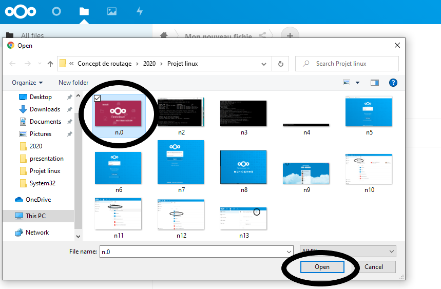
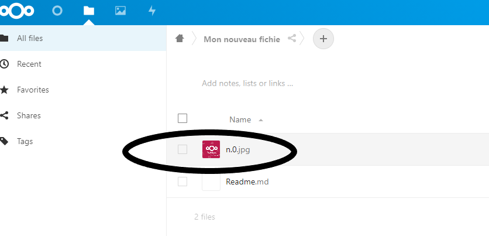

# :sparkles:  INSTALATION DE NEXTCLOUD SUR UBUNTU 20.04 LTS :sparkles: 


---

</img>
 
# :star: DEFINITION :star:

Nextcloud est un logiciel libre, de site d’hébergement de fichiers  et une plateforme de collaboration.


## :bookmark: Comment installer NEXTCLOUD sur ubuntu serveur 20.04 LTS :question: 

## :pushpin: Step 1: Allez en mode administrateur

```
$ sudo -i
```

</img>


 ## :pushpin: Step 2: Instalation de Snap
 
:heavy_check_mark: **Snap** C'est un système de packaging, disponible sur Ubuntu 20.04 par défaut et qui permet aux organisations d'expédier les logiciels, ainsi que toutes les dépendances et la configuration associées, dans une unité autonome avec des mises à jour automatiques.
```
$ apt install snapd
```
</img>


 ## :pushpin: Step 3: Instalation de Nextcloud en utilisant le système de packaging snap

:heavy_check_mark: Le format snap vise à permettre l'installation de nouvelles versions de logiciels dans les systèmes Linux, tout en apportant la facilité de distribution, la fiabilité et la sécurité.

```
$ snap install nextcloud
```

</img>


## :bookmark: Comment accéder au logiciel libre, de site d'hebergement de fichier et une plateforme de collaboration NEXTCLOUD :question: 


## :pushpin: Step 3: accès au logiciel Nextcloud 
 
:heavy_check_mark: Après l'installation, entrer votre IP adresse (l'adresse de votre serveur sur laquelle vous avez installé NEXTCLOUD) dans un navigateur de recherche et taper sur enter une nouvelle page doit s'ouvrir à vous. 
 
</img>


## :pushpin: Step 4: Ouverture d'un compte 

:heavy_check_mark: Utiliser vos information personnel pour créer un compte ( Nom d'utilisateur et  mot de passe )

</img>


## :pushpin: Step 5: Commencez à utiliser Nextcloud


</img>

:heavy_check_mark: cliquez sur la flèche à droite pour défiler ensuite Start to using Nextcloud


## :pushpin: Step 5: Créer un fichier sur Nextcloud

Avec Nextcloud nous pouvons Stockez nos documents, calendriers, contacts et photos sur un serveur à domicile, chez l'un de nos fournisseurs ou dans un centre de données de votre confiance. Pour Notre expérience nous devons créer un fichier dans lequel nous devons sauvegarder une photo.


## : round_pushpin: Let go :muscle:


## :bulb: Clike sur le dossier file 

</img>


## :bulb:  Clike sur new floder

</img>


## :bulb: Entre le nom du fichier que vous voulez creer

</img>


## :bulb: Cliker sur le dossier que vou venez de ceer

</img>


## :bulb: Cliker sur lesigne plus en haut à la droite de la fenêtre en suite sur upload file

</img>


## :bulb: Choisissez le fichier que vous voulez sauvegarder en suite sur open

</img>


## :bulb: Votre fichier est maintenant sauvegardé dans Nextcloud :clap:

</img>


:relaxed: À présent vous pouvez sauvegarder vos documents importants dans votre copte Nextcloud et l'utiliser où que vous soyez et en toute sécurité. :tada:

