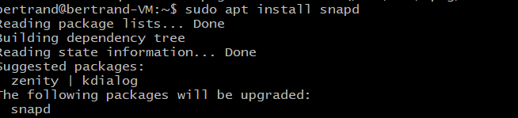
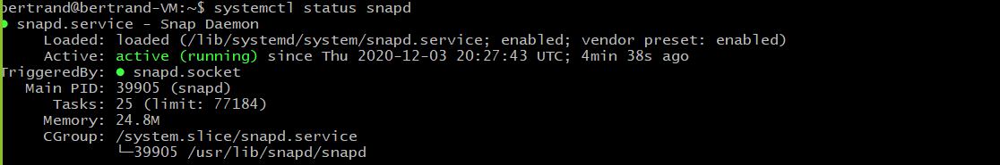
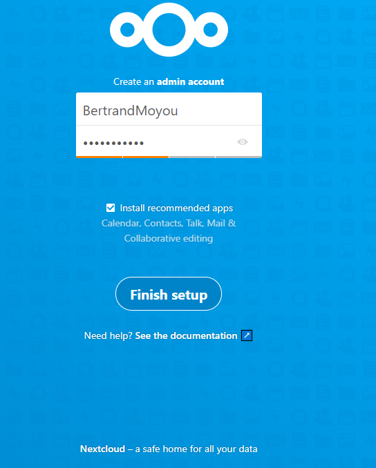
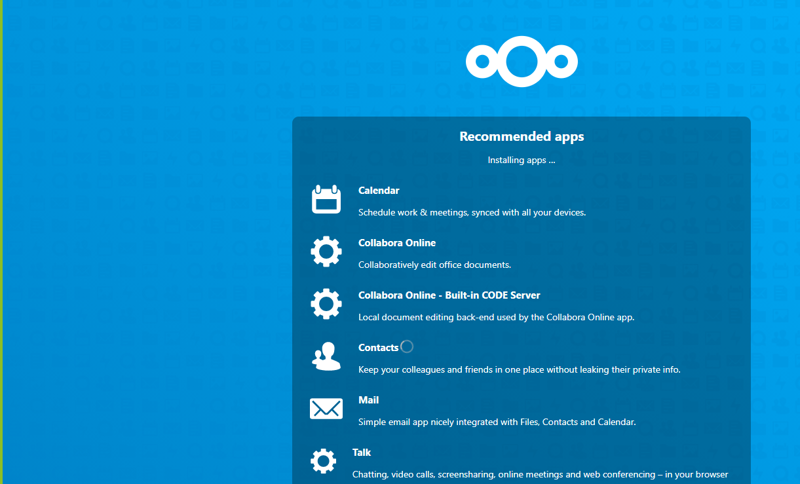
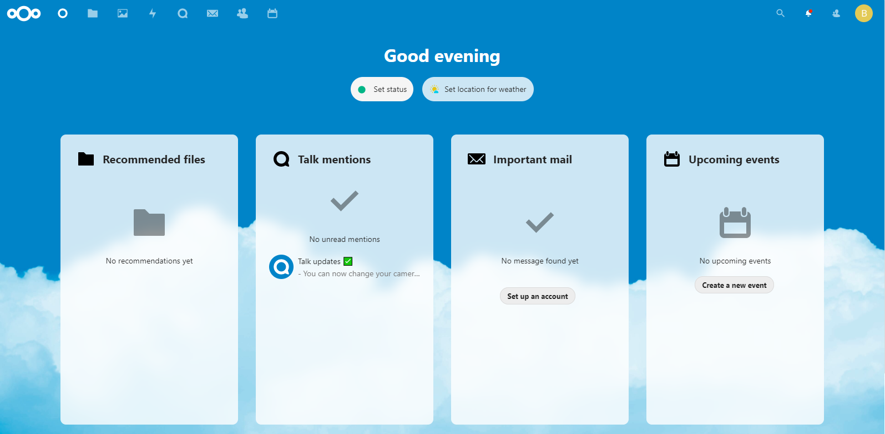

# :pushpin: NEXTCLOUD

---
## A PROPOS 
 **NextCloud**est un logiciel libre, de site d'hébergement de fichiers et une plateforme de collaboration. À l'origine accessible via WebDAV, n'importe quel navigateur web, ou des clients spécialisés, son architecture ouverte a permis de voir ses fonctionnalités s'étendre depuis ses origines. En 2020, il propose de nombreux services.

---

# INSTALATIONS :round_pushpin:

## :one: Snap  
**Snap** Le format snap vise à permettre l'installation de nouvelles versions de logiciels dans les systèmes Linux, tout en apportant aux développeurs la facilité de distribution, la fiabilité et la sécurité.Nous l'utiliserons pour installer notre NextCloud 
```
$ sudo apt install snapd
```


```
Vérification du staut de snap

$systemctl status snap
```


## :two:NextCloud
```
$sudo snap install nextcloud
```


# CONFIGURATION DE NEXTCLOUD:round_pushpin:

## :one: Configuration de l'Administrateur

## Installation des applications

```
Une fois l'administrateur cré les applications (Utilitaires) s'installent automatiquement
```


```
 Tableau de Bord
```

## :two:Création d'un utilisateur
```
$ sudo nextcloud.occ user:add Bertrand
```

## PREREQUIS


