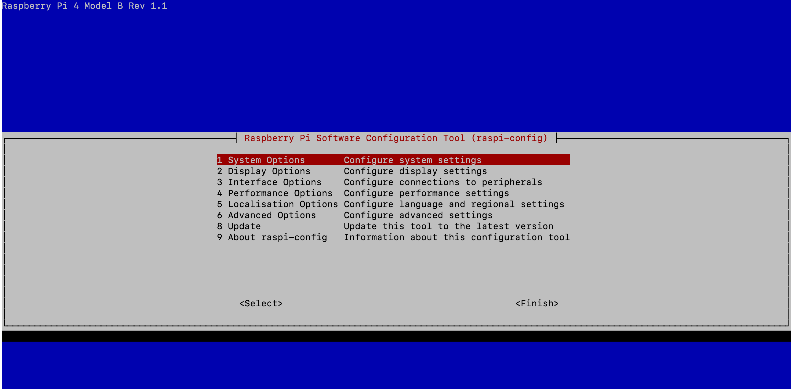
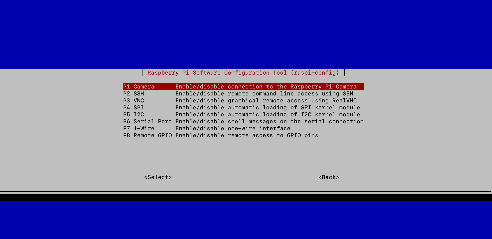
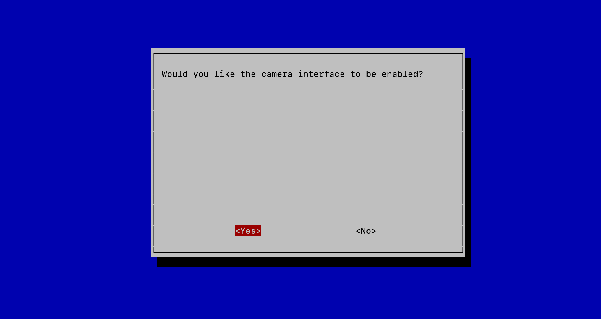

# Projet
## ÉTAPE :one: : PRÉ-REQUIS

### :a: ACTIVER L'INTERFACE DE LA CAMÉRA

`% sudo raspi-config`

### :b: :point_down: choississez "Interface Options    Configure connections to peripherals"  :point_down:

### :c: choississez "yes"

- voilà l'interface caméra est activé

## ÉTAPE :2: : CONFIGURATION DE LA RASPBERRY

- obtenir la mise àjour la raspberry

`% sudo apt-get update`

- installer la mise àjour la raspberry (choississez une commande)

`sudo apt-get upgrade` pour faire la MAJ sécurité (ou fondamentale)

`sudo apt-get full upgrade` pour faire la MAJ totale

vous pouvez rajouter `-y` à la fin de la commande choisi pour que le systéme fasse *yes* aux questions lors de la MAJ

## ÉTAPE :three: : VÉRIFIER SI L'INTERFACE CAMÉRA ET LA CAMÉRA PHYSIQUE

`raspistill -o test.jpg`
``

``
## ÉTAPE 3 : INSTALLATION  DES APPLICATIONS NÉCESSAIRES

- on utilisera *motion* pour notre projet

`sudo apt-get install motion`

## ÉTAPE 4 : CONFIGURATION DES APPLICATIONS INSTALLÉES

`sudo nano /etc/motion/motion.conf`

##### voici les configurations à modifier :point down:

> daemon   on

- pouvoir lancer motion en tant que daemon, et pouvoir ainsi libérer un terminal

> framerate   10

- Ce chiffre montre le nombre d’images enregistrées par seconde. Chiffre élevé = RAM consommée.

> stream_port   8081

> stream_quality   100

> stream_localhost   off

> stream_motion   off

> stream_maxrate (de 10 à 30)

> webcontrol_localhost   off

> quality   100

> width   640

> height   480

> post_capture   5

> pre_capture   2

> ffmpeg_output_movies  OFF

> output_pictures   OFF

ÉTAPE 5 : VÉRIFICATION FINALE
``
